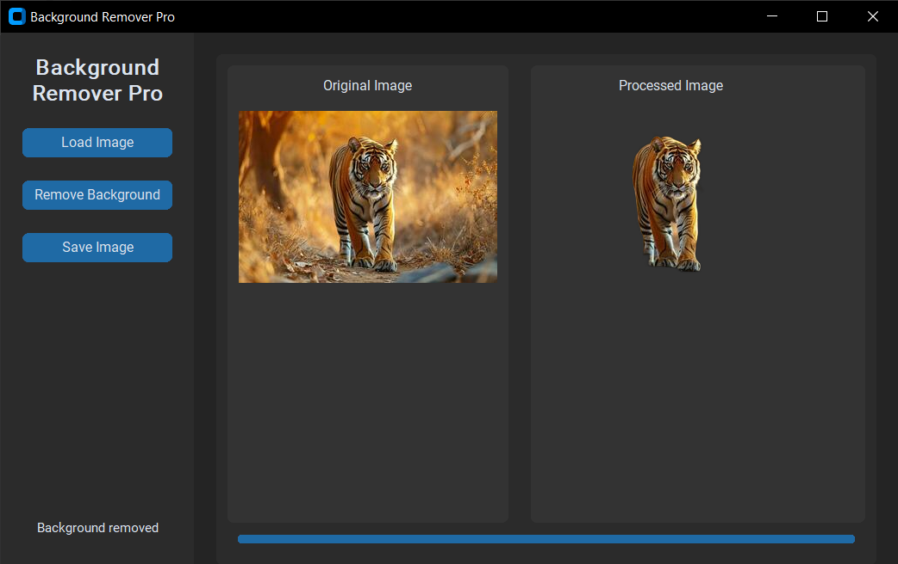

# 🖼️ Background Remover Pro

**Background Remover Pro** is a user-friendly desktop application built with Python and `customtkinter` that lets you remove the background from images with a single click using the powerful [rembg](https://github.com/danielgatis/rembg) library.

<!-- Replace with real screenshot URL if available -->

---

## ✅ Features

- Load common image formats (`.jpg`, `.png`, `.webp`, `.bmp`)
- Instantly remove image backgrounds using AI
- Save the processed image as PNG
- Beautiful and responsive UI with progress indication
- Error handling and status updates

---

## 🚀 Download & Install

Click below to download the `.exe` file:

> ⚠️ Note: This is a standalone Windows executable. No Python installation is required.

---

## 🛠 How to Use

1. **Launch the App**
   - Double-click the downloaded `BackgroundRemoverPro.exe`

2. **Load an Image**
   - Click the **Load Image** button and select your image.

3. **Remove Background**
   - Click the **Remove Background** button to process the image.

4. **Save the Result**
   - After previewing, click **Save Image** to download the output.

---

## 📦 Built With

- [Python](https://python.org/)
- [customtkinter](https://github.com/TomSchimansky/CustomTkinter)
- [rembg](https://github.com/danielgatis/rembg)
- [Pillow](https://python-pillow.org/)

---

## 📁 Project Structure

